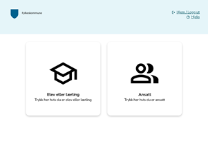

# onboarding-web
SPA for onboarding peoples

Onboarding, tilbakestilling av passord, og verifisering av brukere ved bruk av ID-porten. Dette er frontend, bruker BFF for autentisering / autorisering. [Se BFF / onboarding-api her](https://github.com/vestfoldfylke/onboarding-api)



## Flyter
### Tilbakestill passord
- Velger aktiver bruker/tilbakestill passord
- Script spør onboarding-api om å få loginurl til idporten, med action "resetpassword" som query param - redirecter så til id-porten-loginUrl den får av onboard-api
- Bruker logger på idporten og blir redirected tilbake til /idportencallback
- /idportencallback sjekker at den har fått med seg state, code, og iss i query params, så sjekker den om action (i state) er "resetpassword", og sender bruker over til /resetpassord sammen med state, code, og iss
- /resetpassord sender så mottat state, code, iss videre til onboarding-api/ResetPassword - api logger inn brukern, resetter passordet, sender sms ++
- Bruker klikker så på "Klikk her når du har fått SMS" når hen har fått SMS  - script spør så api om å gå loginurl til password-appreg (EntraID), og redirecter til denne
- Bruker logger på entraID (password appreg) - blir sendt tilbake til /entrapwdcallback
- /entrapwdcallback tar i mot state og code, sender over til onboarding-api, logger inn bruker, returnerer upn og logEntryId
- /entrapwdcallback script ber deretter om loginurl til mfa-appreg (EntraID), og redirecter til denne
- Bruker logger på entraID (mfa appreg) - blir sendt tilbake til /entramfacallback
- /entramfacallback tar i mot state og code, sender over til /success
- /success sender over state og code til onboarding-api, api logger inn brukeren (igjen), returner upn, logEntryId, displayName. Nå er den ferdig

### Aktiver / verifiser bruker
- Velger aktiver/verifiser bruker
- Script spør onboarding-api om å få loginurl til idporten, med action "verifyuser" som query param - redirecter så til id-porten-loginUrl den får av onboard-api
- Bruker logger på idporten og blir redirected tilbake til /idportencallback
- /idporten callback sjekker at den har fått med seg state, code, og iss i query params, så sjekker den om action (i state) er "verifyuser", og sender bruker over til /verifyuser sammen med state, code, og iss
- /verifyuser sender så mottat state, code, iss videre til onboarding-api/VerifyUser - api logger inn brukern (idporten), returner logEntryId, upn, displayName
- /verifyuser script ber deretter om loginurl til mfa-appreg (EntraID), og redirecter til denne
- Bruker logger på entraID (mfa appreg) - blir sendt tilbake til /entramfacallback
- /entramfacallback tar i mot state og code, sender over til /success
- /success sender over state og code til onboarding-api, api logger inn brukeren (igjen), returner upn, logEntryId, displayName. Nå er den ferdig

## Routes
### /
Startside, gir deg valget om du er elev eller ansatt

### /elev
Elevside, gir deg bare et valg - tilbakestill passord. Kan vel utvides om det trengs.
- Tilbakestill passord spør api om loginUrl til ID-Porten (params: user_type=elev&action=resetpassword) og redirecter deg dit

### /ansatt
Ansattside, gir deg valg om å verifisere brukeren din, eller tilbakestille passord
- Tilbakestill passord spør api loginUrl til ID-Porten (params: user_type=ansatt&action=resetpassword) og redirecter deg dit

### /idportencallback
Callbackside for ID-porten redirects. Tar i mot state, code, iss - henter userType og action fra state, og sender videre førhåldsvis til /resetpassord eller /verifyuser (jøss, her har jeg brukt norsk og engelsk om hverandre...)

### /resetpassord
Får state, code, og iss fra page-state. Sender over til api, og venter på respons. Bruker kan klikke seg videre når hen har fått midlertidig passord på SMS. Da hentes loginUrl for entraPwd enterprise-app, viser ei litta dialog med info om neste steg, og redirecter til loginUrl etter noen sekunder.

### /verifyuser
Får state, code, og iss fra page-state. Sender over til api, og venter på respons. Ved 200 respons, henter loginUrl for entraMfa-enterprise-app, og redirecter.

### /entrapwdcallback
Callbackside for entraPwd-enterprise-app redirects. Tar i mot state og code, og sender til api /EntraPwdAuth, om 200 respons, henter loginUrl for entraMfa-enterprise-app og redirecter til respons

### /entramfacallback
Callbackside for entraMfa-enterprise-app redirects. Tar i mot state og code, sjekker state om den inneholder en action, og sender videre førhåldsvis til /success eller /stats

### /success
Får state og code fra page-state. Sender over til api, og venter på respons. Om 200 respons er alt good, og kidden viser tommel opp 👍

### /admin
Litt småskjult - gir deg valg om å logge på for å se statistikk 

### /stats
Får state og code fra page-state. Sender over til api, og venter på respons. Om 200 respons følger det med statistikk, og UX-designer har laget masse fine grafer.

## Theme
/static/theme kan ha forskjellige temaer. Lag ditt eget og benytt VITE_THEME_NAME-variabelen

## Env variables
```bash
VITE_THEME_NAME="" # Eksempel "vestfold" for vestfold-theme (mappe)
VITE_ONBOARDING_API_URI="http://localhost:7071/api" # Trengs ikke om mock-api er true
VITE_ONBOARDING_API_PUBLIC_KEY="skikkeligbrakeysomerpublicallikevelsåikkesåfarlig" # Trengs ikke om mock-api er true
VITE_MOCK_API="true/false" # Om "true", så mockes alle api-kall 
VITE_SERVICEDESK_TLF="33 44 55 66"
VITE_SERVICEDESK_EPOST="servicedesk@fylke.no"
```

## Mock-api
Sett VITE_MOCK_API til "true", da mockes alle api-kall lokalt i browser. Sjekk ./src/lib/useApi.js for å se mocke-data (må være samme format som API returnerer da)

## Utvikling
- Klon ned, eller fork, og klon ned
- `npm i`
- `npm run dev`
- Herje i vei

### Publiser til Azure Web App - Nodejs

- Det du trenger av konfigurasjon i .env
- Benytt adapter-node i svelte.config.js:1 ` import adapter from '@sveltejs/adapter-node' `
- `npm run build`
- Legg til 'package.json'-fil i 'build'-mappen med dette innholdet: `{ "type": "module" }`
- Publiser 'build'-mappen til Azure WebApp. 